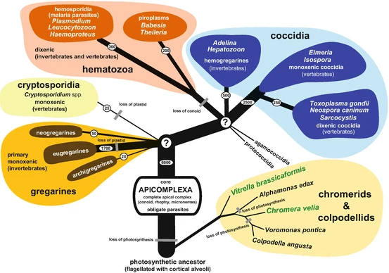

# Phylogeny Exercise Solutions

Author: Vi Varga

Course: Applied Bioinformatics (BBT045)

Date: 14.02.2023


## Introduction

In this exercise you will practice your newly acquired skills in phylogenetic inference and "tree thinking", by analyzing the evolutionary history of a gene family. Please note that unlike the tutorial, this exercise should be completed _on your own_. If you have questions, please reach out to me via e-mail (virag.varga@chalmers.se) or message me on Canvas. The assignment should be uploaded to a new subdirectory named `PhyloExercise/` in the same GitHub repository that you have used to turn in your homeworks thus far. Remember to add me as a collaborator (GitHub ID: V-Varga) so that I can access your solutions, since your repository should be private! Your solutions should be provided in a document with Markdown syntax formatting (ex.: .md, .Rmd, .qmd, .ipynb), and should be uploaded to your GitHub repository by **23.59 on Friday, February 17, 2023**, along with the requested supplementary files.

In this exercise you are going to follow the phylogenetic analysis workflow discussed during the lecture and tutorial, starting with collecting the data necessary for running the analysis (in the form of homologous protein sequences from different species), through the interpretation of the results (i.e., comparing species trees and gene trees).

For this exercise, you will be working with species within a phylum of protists (single-celled eukaryotes) known as the Apicomplexans. Apicomplexans are mostly obligate parasites, meaning that they rely entirely on their host organism to survive. There is debate about over the possibility of some species from this phylum being host-associated but non-parasitic, and some recently-discovered Apicomplexans are thought to be free-living, though they are not well-studied (del Campo et al. 2019). 



> Source: Votýpka et al. 2016

A Newick tree for the clades of interest is provided below (as well as in the Apicomplexa_clades.nwk file): 

> (Gregarinasia,(Cryptosporidia,((Piroplasmida,Haemosporidia),Coccidia)));

When visualized as a cladogram, the tree looks like this: 


Below are listed the species you will be working with: 
 - _Porospora gigantea_ 
 - _Plasmodium falciparum_
 - _Babesia microti_
 - _Toxoplasma gondii_
 - _Cryptospodidium parvum_

1. Which clade of Apicomplexa do each of the above species belong to? List them below. 

> _Fill in your answer!_

You might recognize some of these names! Phylum Apicomplexa contains a number of medically important parasites: 
 - _Cryptosporidium_ species cause Cryptosporidiosis, a water-borne diarrheal disease that often affects immunocompromised people. 
 - _Babesia_ species cause Babesiosis, a tick-borne illness that causes flu-like symptoms. Since the parasite infects and destroys red blood cells, it can also cause anemia. 
 - _Toxoplasma gondii_ causes the disease Toxoplasmosis, which humans contract from food and/or being around pets that are infected. Most infections are asymptomatic, though it can cause flu-like symptoms and serious complications for the fetus if contracted during pregnancy, up to stillbirth or miscarriage. 
 - _Plasmodium falciparum_ is a causative agent of Malaria, a disease which still kills more than half a million people each year. Among the _Plasmodium_ species, _P. falciparum_ causes the most deadly strain of the disease. 

The Gregarines are comparatively mild parasites - they infect invertebrates, and are rarely fatal to the organisms they infect. 

2. Why might it be important to study organisms like the Gregarines? (Hint: Take another look at the phylogenetic tree of Apicomplexa.)

> _Fill in your answer!_

Before moving on to the actual phylogenetic workflow, you should also decide what the outgroup will be. This won't actually come into play until the visualization stage, but it's always good practice to be thinking ahead when following a research pipeline.

3. Which group of organisms should be the outgroup? _Why?_

> _Fill in your answer!_

You may be wondering, "Why not select an outgroup from elsewhere in Alveolata [the superphylum that Apicompla belongs to]?" After all, the Gregarines are considered part of Apicomplexa - aren't they too closely related to the rest to be useful in a study like this? 

In most cases, you might be right! A group of organisms like those in Chromerida, which are also in Alveolata but not considered Apicomplexans, might be a better choice! 

> (Chromerida,(Gregarinasia,(Cryptosporidia,((Piroplasmida,Haemosporidia),Coccidia))));


In this case, we'll be using the Gregarines because of the gene families presented to you as options - all of these gene families are involved in the "glideosome," which is a key component of Apicomplexan pathogenicity. The glidesome is involved in parasite attachment to, movement along and invasion of host cells. More distantly related species within Alveolata may not have copies of these genes. For example, _C. velia_ doesn't have a copy of the ROM4 gene (Boisard et al. 2022).


## Obtaining & Exploring Data

For this exercise, you will be obtaining your own data from the NCBI database. 

You will start by selecting a gene family to study. Below I've listed a few options: 
 - ROM4
 - AKMT
 - MyosinA
 - DGK1

Since _Plasmodium falciparum_ and _Toxoplasma gondii_ have really well-annoted genomes, search for the gene sequence of your choice on the NCBI with, for example: "Plasmodium falciparum[orgn] ROM4". Save the header and amino acid sequence to a FASTA file on your local machine. I've provided _recommended_ search combinations below to make things go a bit more smoothly; the members of these protein families do not all include these gene family names in the actual names of the individual genes themselves on the NCBI. If there are multiple results, just go with the first gene hit.

Search _recommendations_: 
 - ROM4: _P. falciparum_ ROM4
 - MyosinA: _P. falciparum_ Myosin-A
 - AKMT: _T. gondii_ apical complex lysine methyltransferase
 - DGK1: _T. gondii_  diacylglycerol kinase accessory domain

Save the FASTA sequence of your selected reference protein representative of your chosen protein family to a file on your local computer. **This file should be included in your assignment submission directory on GitHub.**

Next, you'll need to obtain homologous gene sequences from the NCBI database. BLAST your protein sequence on the web to accomplish this, and choose the "FASTA (complete sequence)" download option. **This file should be included in your assignment submission directory on GitHub.**

Note that you can select specific organisms to BLAST against on the NCBI - this significantly reduces the amount of time a search takes, and in our case, makes sure you get only the information you're looking for. There are of course many members of the Apicomplexa that we will not be working with here - no need to sift through all of the gene sequences from those organisms. Include only our 5 species of interest; note that you'll need to select both the A and B versions of _P. gigantea_ individually.

4. Open your multiple sequence FASTA and describe some of its characteristics. How many sequences are in the file? How many representatives of each species are there (count the two _P. gigantea_ species as only one)?

> _Fill in your answer!_

1. Describe the following examples with all words that apply from among: homologous, orthologous, paralogous

 a. Two copies of MyosinA in _B. microti_

 > _Fill in your answer!_

 b. Copies of AKMT in _P. falcigarum_ and _T. gondii_

 > _Fill in your answer!_

Before proceeding on to the construction of the MSA, clean your sequences. 

6. Do you notice any differences in the files? What does this tell you? 

> _Fill in your answer!_


## Multiple Sequence Alignment

Now that you've familiarized yourself with the data, it's time to create a multiple sequence alignment. 

7. Write the code you used to create the MSA below. Explain the meanings of the flags, and why you chose to use them.  

> _Fill in your answer!_

```bash
#Fill in your code here!
```

**This MSA file should be included in your assignment submission directory on GitHub.**

Now open the MSA file in your alignment viewer of choice.

8. What patterns do you observe? 

> _Fill in your answer!_


## Creating the Tree

Now it's time to create a phylogenetic tree. Since you're less pressed for time than you were in-class, use the model finder option of IQ-TREE. Include the code below, so you have it recorded somewhere!

```bash
#Fill in your code here!
```

9. Which tree model did IQ-TREE pick for you? 

> _Fill in your answer!_

**The PREFIX.treefile and PREFIX.log files should be included in your assignment submission directory on GitHub.**

Now open the PREFIX.treefile in a phylogenetic tree visualizer of your choice. 

10. What does it look like to you? Do you notice anything? 

> _Fill in your answer!_

Edit the alignment one time, either manually or using a tool. Save the new MSA, and run IQ-TREE on it again, using the model that IQ-TREE previouslsy determined to be the best fit for you. **The new MSA file, PREFIX.treefile and PREFIX.log files should be included in your assignment submission directory on GitHub.**

11. What method of alignment editing did you choose to use? Does your alignment look different in an alignment viewer? Does the resulting tree look different? How so? 

> _Fill in your answer!_


## Comparing the gene tree with the species tree

Finally, compare the two gene trees you have visualized with the species tree given to you. (The R script provided to you during the tutorial may help with this, but feel free to do it your own way!) **Include .png/.svg/.jpeg/etc. versions of both of your visualized phylogenetic trees in your assignment submission directory on GitHub.**

12. How do the gene trees compare to the species tree? Do you notice any interesting patterns? 

> _Fill in your answer!_

13. Is this a good gene family for creating a species tree? Why or why not? 

> _Fill in your answer!_


## Citations

> <div class="csl-entry">Boisard, J., Duvernois-Berthet, E., Duval, L., Schrével, J., Guillou, L., Labat, A., le Panse, S., Prensier, G., Ponger, L., &#38; Florent, I. (2022). Marine gregarine genomes reveal the breadth of apicomplexan diversity with a partially conserved glideosome machinery. <i>BMC Genomics</i>, <i>23</i>(1), 1–22. https://doi.org/10.1186/S12864-022-08700-8/FIGURES/5</div> <br>
> <div class="csl-entry">del Campo, J., Heger, T. J., Rodríguez-Martínez, R., Worden, A. Z., Richards, T. A., Massana, R., &#38; Keeling, P. J. (2019). Assessing the diversity and distribution of apicomplexans in host and free-living environments using high-throughput amplicon data and a phylogenetically informed reference framework. <i>Frontiers in Microbiology</i>, <i>10</i>(OCT). https://doi.org/10.3389/fmicb.2019.02373</div> <br>
> <div class="csl-entry">Töpel, M. (2019, November). <i>Webbased Phylogenomic analysis · The-Bioinformatics-Group/Teaching Wiki</i>. GitHub. https://github.com/The-Bioinformatics-Group/Teaching/wiki/Webbased-Phylogenomic-analysis</div> <br>
> <div class="csl-entry">Votýpka, J., Modrý, D., Oborník, M., Šlapeta, J., &#38; Lukeš, J. (2016). Apicomplexa. In <i>Handbook of the Protists</i> (pp. 1–58). Springer International Publishing. https://doi.org/10.1007/978-3-319-32669-6_20-1</div> <br>
